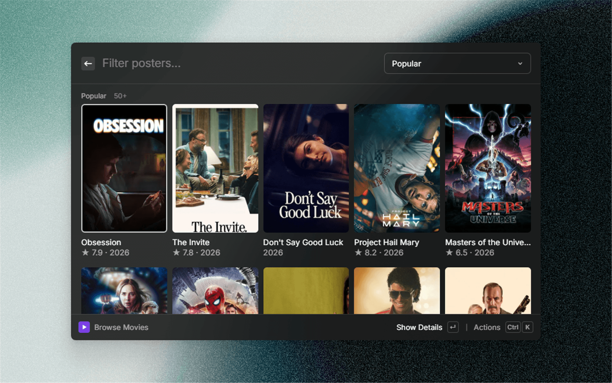
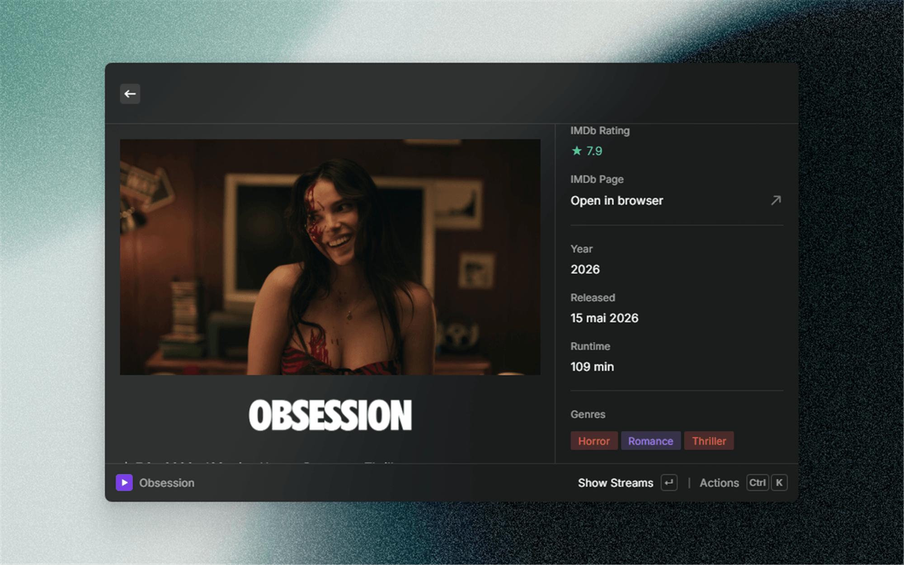
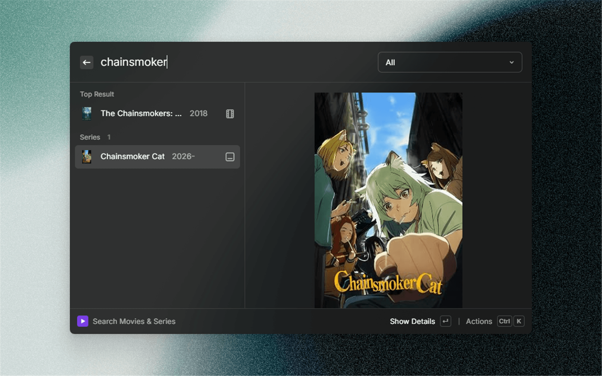
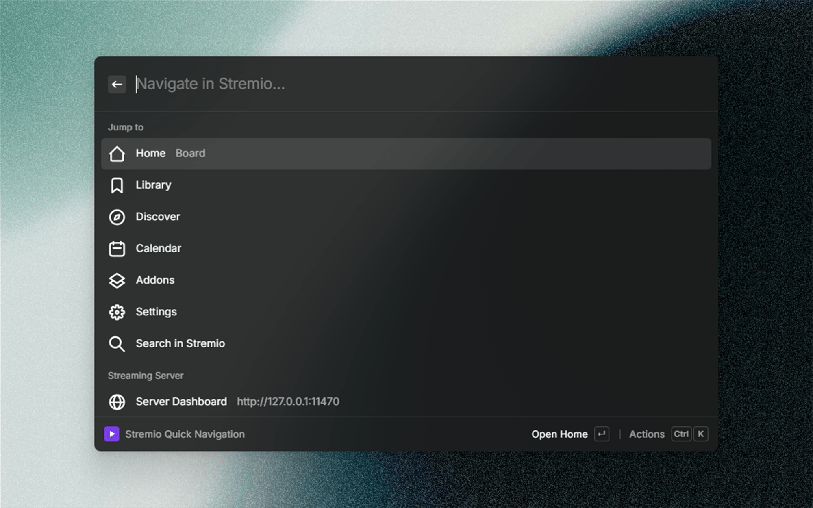

# Stremio

Search movies & series, browse catalogs and play streams from your Stremio setup — without leaving Raycast.

## Features

- **Search Movies & Series** — reactive search across millions of titles (powered by Cinemeta) with a live preview pane, top-result section and filters for type, genre, minimum IMDb rating and sorting. Recent searches are kept locally for one-keystroke replay.
- **Browse Catalogs** — a poster gallery of popular, new and featured movies & series with genre/year filters and infinite pagination.
- **Rich overview page** — cinematic backdrop, title logo, synopsis and a metadata panel (colored IMDb rating, genres, cast, director, country, awards). Jump to the trailer or IMDb in one action.
- **Play in your favorite player** — streams are resolved from the Stremio addons you configure and played in VLC, mpv or any custom player through the local Stremio streaming server. No downloads, just press Enter.
- **Quick Navigation** — jump straight to Board, Library, Discover, Calendar or Addons in the Stremio desktop app, or push a search query to it.
- **Server Status (menu bar)** — live indicator of the local Stremio streaming server: connection state, download speed, peers and streaming progress at a glance.

## Requirements

- [Stremio](https://www.stremio.com/) desktop app installed and signed in (deep links + the local streaming server on port 11470).
- VLC or mpv for external playback (VLC is auto-detected; any custom player executable can be configured).

## Setup

1. Install the extension and open **Search Movies & Series**.
2. If your Stremio streaming server does not run on the default `127.0.0.1:11470`, adjust the host/port in the extension preferences (press `Ctrl K` → *Configure Extension* from anywhere in the extension).
3. Optional: paste the manifest URL of a Stremio addon into one of the four **Stream Addon** slots in the extension settings (press `Ctrl K` → *Configure Extension*). Catalogs and streams are merged with the built-ins — adding a stream addon enables playback. Need more? Use the advanced comma-separated field.

## Preferences

| Preference | Description |
|--------------------------|-------------|
| Streaming Server Host | Host of the local Stremio streaming server (default `127.0.0.1`). |
| Streaming Server Port | Port of the streaming server (default `11470`). |
| Default Content Type | Content type preselected when searching and browsing. |
| Gallery Columns | Poster column count of the catalog gallery. |
| Preferred Player | VLC, mpv, auto-detect or a custom executable. |
| Custom Player Path | Executable path used when Preferred Player is set to *Custom*. |
| Player Arguments | Extra arguments appended before the stream URL. |
| Default Playback Action | Whether Enter plays in the external player or opens Stremio. |
| Stream Addon 1–4 | Manifest URLs of your Stremio addons (catalogs + streams merged with the built-ins). |
| More Addon Manifests (advanced) | Comma-separated manifest URLs, if you need more than four slots. |

## Shortcuts

| Shortcut | Action |
|-----------|-----------------------------------|
| `↵` | Primary action (details / play) |
| `Ctrl K` | Configure the extension, anywhere |
| `⌘⇧ P` | Play the selected stream externally |

## Disclaimer

This extension is not affiliated with Stremio. It uses the public Cinemeta API, the addon manifests you configure and your locally installed Stremio streaming server. Please make sure your usage complies with the laws of your country.
